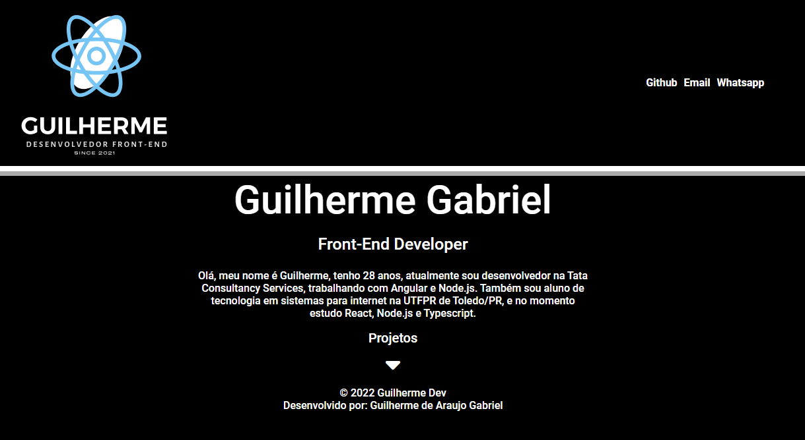
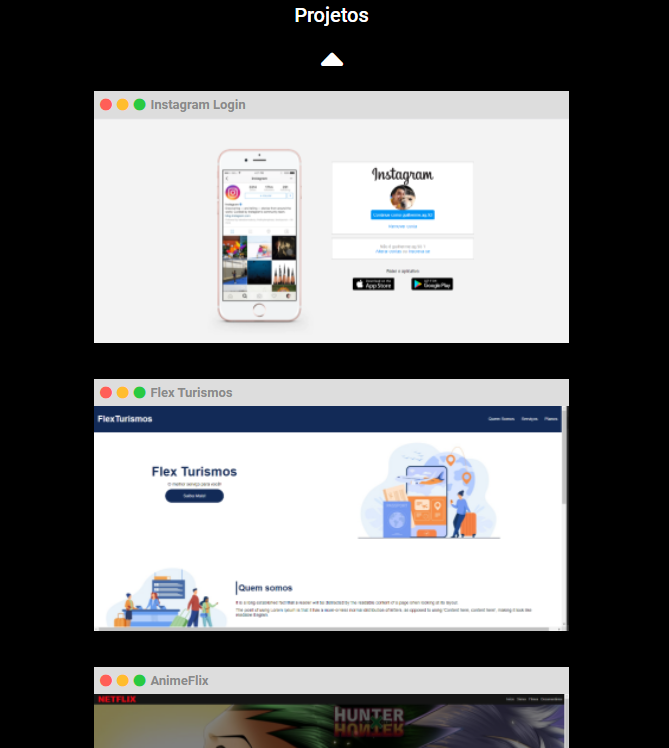
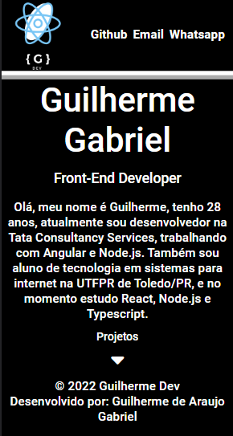
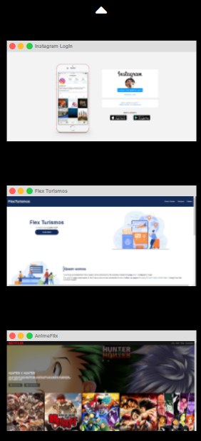

# Hiring Coders 3 - CSS

## Projeto de portfólio durante a fase de aquecimento do HC-3

O objetivo desse projeto foi colocar em prática os conhecimentos adquiridos durante o curso de CSS da [Gama Academy](https://www.gama.academy/), por meio de uma atividade prática.

## Tecnologias utilizadas

- HTML.
  
- CSS.

- JavaScript.
  
## Preview do projeto

Preview desktop.

Preview mobile.

## Como testar o projeto

### Clone o repositório e abra remotamente

Digite no seu terminal

``
git clone https://github.com/guilhermag/hc3-portfolio-curso-css.git
``

``
cd hc3-portfolio-curso-css/
``

Agora é só abrir o ``index.html``.

## Créditos

Desenvolvido por Guilherme de Araujo Gabriel.
